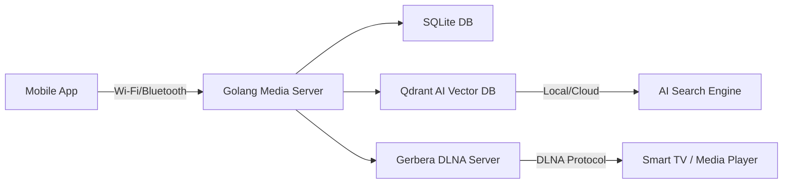

# SmartHome AI Media Hub

## Overview
SmartHome AI Media Hub is a local-first storage system that lets you securely store photos and videos on a Raspberry Pi (or any Linux device) using an external SSD. It provides **DLNA streaming** via Gerbera, **semantic search** using local AI embeddings, and **Wi-Fi/Bluetooth hybrid connectivity** for smart TVs and mobile devices.

### Key Features
- 🧠 **AI Semantic Search** — Find photos and videos using natural language (e.g., “beach sunset 2023”).
- 📡 **DLNA Streaming** — Access content directly on your Smart TV or mobile media apps.
- 🔒 **Local Privacy** — All data stored and indexed locally.
- 🌐 **Hybrid Connectivity** — Works via Wi-Fi or Bluetooth (for discovery or limited file sharing).
- 💾 **Local + Cloud AI Hybrid** — Optional encrypted AI indexing in the cloud for faster processing.

---

## Architecture



---

## Components
- **Backend:** Golang (Fiber, SQLite, Qdrant client)
- **DLNA Server:** Gerbera (Docker)
- **Vector Search:** Qdrant (Docker)
- **AI Indexer:** Python microservice (optional, for embeddings)
- **Storage:** External SSD (partitioned for media use)

---

## Setup Instructions

### 1. Requirements
- Raspberry Pi 5 (8GB RAM recommended)
- External SSD with one partition for media
- Docker + Docker Compose installed

### 2. Build & Run
```bash
make build
make run
```

### 3. Access
- **DLNA:** Auto-discovered on Smart TVs or DLNA-compatible apps.
- **Mobile App:** Connect over Wi-Fi using the local IP (e.g., `192.168.1.100:8080`).
- **Search API:** `GET /api/search?q=beach sunset`

---

## Project Structure
```
.
├── cmd/
│   └── server/
│       └── main.go
├── internal/
│   ├── media/
│   ├── db/
│   └── search/
├── Makefile
├── docker-compose.yml
└── README.md
```

---

## Example Search API
```bash
curl http://192.168.1.100:8080/api/search?q=mountain+trip
```

Response:
```json
{
  "results": [
    { "file": "mountain_trip_2024.jpg", "score": 0.92 },
    { "file": "trekking_valley.png", "score": 0.88 }
  ]
}
```