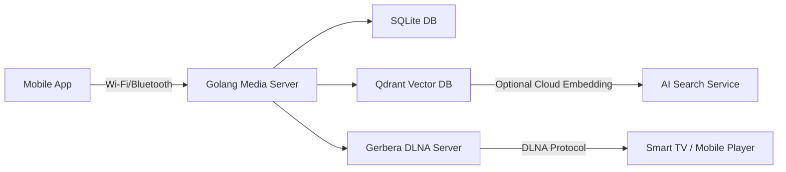

# 📦 LocalCloud — Self-Hosted Personal Cloud (Drive-like UI)

LocalCloud is a lightweight self-hosted cloud system that lets you **browse, upload, search, and preview** files and images — all stored locally on your laptop, accessible anywhere securely.

---

## 🚀 Features

- Google Drive / Photos-style UI (responsive for desktop & mobile)
- File & image preview with thumbnails  
- Directory browsing and navigation  
- Regex search by filename or metadata  
- Optional phone sync API  
- Secure login system  
- Remote access using **ngrok**

---

## 🧩 Architecture



---

## 🧠 Components
| Component | Description |
|------------|--------------|
| **localcloud** | Golang backend — manages media ingestion, metadata, and search API |
| **ai-service** | Python-based embedding generator for semantic search |
| **qdrant** | Vector database for AI-powered search |
| **gerbera** | DLNA server for streaming on Smart TVs |
| **SQLite** | Lightweight local database for metadata and indexing |
| **web/** | Lightweight Google Drive–style UI |

---

## 📁 Project Structure

```
localcloud/
├── cmd/
│   └── server/
│       └── main.go
├── internal/
│   ├── api/             # Go backend handlers
│   ├── db/              # SQLite database setup
│   ├── sync/            # Backup & phone sync logic
│   └── utils/
├── web/
│   ├── public/
│   │   └── index.html   # Frontend UI
│   └── assets/
├── Makefile
├── go.mod
├── go.sum
└── README.md
```

---

## ⚙️ Setup

### 1. Clone and Build

```bash
git clone git@github.com:mayur-tolexo/localcloud.git
cd localcloud
export APP_USER=user
export APP_PASS=securepass
make run-local DATA_DIR=~/LocalCloudData PORT=8080
```

This starts the backend and serves UI at  
👉 http://localhost:8080  

---

### 2. Create an Admin User

On first run, you’ll be prompted to create a username and password for login.

Credentials are stored securely (hashed) in SQLite DB under `~/.localcloud/localcloud.db`.

---

### 3. 📱 Enable Remote Access (ngrok)

Install **ngrok** (free account required):

```bash
brew install ngrok
ngrok config add-authtoken <YOUR_AUTH_TOKEN>
```

Expose your running server:

```bash
ngrok http 8080
```

Ngrok will show a **public URL** like:

```
Forwarding  https://abcd1234.ngrok.io → http://localhost:8080
```

Now you can access your LocalCloud app from **any device** at:

👉 https://abcd1234.ngrok.io  

---

## 🔍 Searching

You can search for files by:
- Exact name  
- Regex pattern  
- EXIF metadata (date, camera model, etc.)

Example:  
`sunset.*2024` → matches all images with “sunset” in name taken in 2024  

---

## 📸 Mobile View

Open your ngrok URL in your phone browser.  
The UI auto-adjusts for mobile — allowing:
- Scrollable thumbnail grid  
- Back navigation  
- Quick search bar on top  

---

## 🔄 Optional: Auto Backup & Phone Sync

To sync your phone photos regularly:
- Use the `/api/sync/upload` endpoint
- The mobile client can POST files periodically
- Files are stored under `DATA_DIR/backups/<device_id>/`

Example:
```bash
curl -F "file=@/path/to/photo.jpg" -u "user:password"      https://abcd1234.ngrok.io/api/sync/upload
```

---

## 🧹 Cleanup & Logs

To clear cache or thumbnails:
```bash
make clean
```

Logs are written to:
```
~/.localcloud/logs/server.log
```

---

## 🧰 Developer Notes

| Command | Description |
|----------|--------------|
| `make run-local` | Run locally on macOS/Linux |
| `make build` | Build Go binary |
| `make test` | Run all tests |
| `make clean` | Remove build artifacts |

---

## 🔒 Security Notes

- Basic Auth over HTTPS (through ngrok)
- Files never leave your laptop
- Passwords are hashed using bcrypt
- Use `ngrok reserved domain` for a permanent public address (free tier supported)
