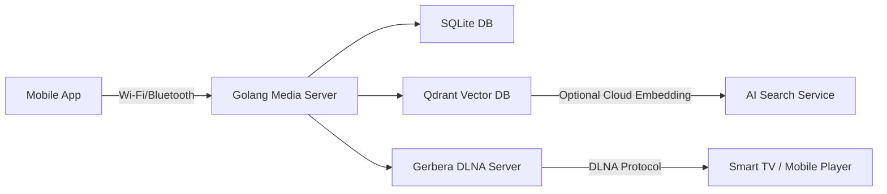

# SmartHome AI Media Hub

## Overview
SmartHome AI Media Hub is a **local-first personal cloud** that stores photos and videos securely on a Raspberry Pi (or any Linux device) using an external SSD.  
It provides **DLNA streaming**, **semantic AI search**, and **Wi-Fi/Bluetooth hybrid connectivity** for Smart TVs and mobile devices — all while keeping your data private and local.

---

## ✨ Key Features
- 🧠 **AI Semantic Search** — Find media using natural language (“beach sunset 2023”).
- 📡 **DLNA Streaming** — Seamless playback on Smart TVs and media players.
- 🔒 **Local Privacy** — All media and metadata stored locally.
- 🌐 **Hybrid Connectivity** — Wi-Fi and Bluetooth for smart discovery.
- ☁️ **Optional Cloud AI Offload** — Encrypts and processes embeddings remotely if needed.

---

## 🧩 Architecture



---

## 🧠 Components
| Component | Description |
|------------|--------------|
| **localcloud** | Golang backend — manages media ingestion, metadata, and search API |
| **ai-service** | Python-based embedding generator for semantic search |
| **qdrant** | Vector database for AI-powered search |
| **gerbera** | DLNA server for streaming on Smart TVs |
| **SQLite** | Lightweight local database for metadata and indexing |

---

## 🧰 Prerequisites
- Raspberry Pi 5 (8GB RAM recommended)
- External SSD (with one partition for media)
- Docker & Docker Compose installed  
  ```bash
  sudo apt update && sudo apt install -y docker docker-compose
  sudo systemctl enable docker && sudo systemctl start docker
  ```

---

## ⚙️ Setup Instructions

### 1. Clone the Repository
```bash
git clone git@github.com:mayur-tolexo/localcloud.git
cd localcloud
```

### 2. Configure Environment
Create a `.env` file:
```bash
PI_IP=192.168.1.42
CLOUD_API_KEY=your_cloud_api_key_here
```

### 3. Start Services
```bash
docker compose up -d --build
```

### 4. Verify Running Containers
```bash
docker ps
```

Expected services:
- `localcloud` (Golang API) → `:8080`
- `ai-service` (Python AI microservice) → `:5000`
- `qdrant` (Vector DB) → `:6333`
- `gerbera` (DLNA) → auto-discoverable by Smart TV

---

## 🧠 Example Usage

### List all media
```bash
curl http://192.168.1.42:8080/api/media
```

### Semantic Search
```bash
curl "http://192.168.1.42:8080/api/search?q=mountain+trip"
```

**Response:**
```json
{
  "results": [
    { "file": "mountain_trip_2024.jpg", "score": 0.92 },
    { "file": "trekking_valley.png", "score": 0.88 }
  ]
}
```

---

## 🖥️ DLNA Access
1. Ensure your Smart TV or media player is connected to the same Wi-Fi.
2. Open the **DLNA / Media Server** app on the TV.
3. Look for **SmartHome AI Media Hub (Gerbera)**.
4. Browse and play media directly from the Raspberry Pi.

---

## 🧩 Folder Structure
```
.
├── cmd/
│   └── server/main.go        # Golang entrypoint
├── internal/
│   ├── media/                # Media scanner
│   ├── db/                   # SQLite models
│   └── search/               # Qdrant integration
├── python-ai/                # Python embedding microservice
├── gerbera/config/           # DLNA server config
├── docker-compose.yml
├── .gitignore
├── .env
├── Makefile
└── README.md
```

---

## 🐳 Docker Compose Overview
- **localcloud** — Golang backend API  
- **ai-service** — Embedding and AI indexing  
- **qdrant** — Vector DB for similarity search  
- **gerbera** — DLNA streaming  

### Start all services
```bash
docker compose up -d
```

### Stop services
```bash
docker compose down
```

---

## 🔒 Privacy Model
- All media stored locally under `/data`.
- AI embeddings can optionally be synced (encrypted) to cloud Qdrant.
- No external dependency required for private mode.

---

## 🧹 .gitignore Reference
- Excludes media, DB files, Docker volumes, and build artifacts.
- Keeps repo lightweight and secure.

---

## 🧭 Git Setup
```bash
git init
git add .
git commit -m "Initial commit - SmartHome AI Media Hub setup"
git remote add origin git@github.com:mayur-tolexo/localcloud.git
git branch -M main
git push -u origin main
```

---

## 📜 License
MIT © 2025 SmartHome AI Hub Contributors
